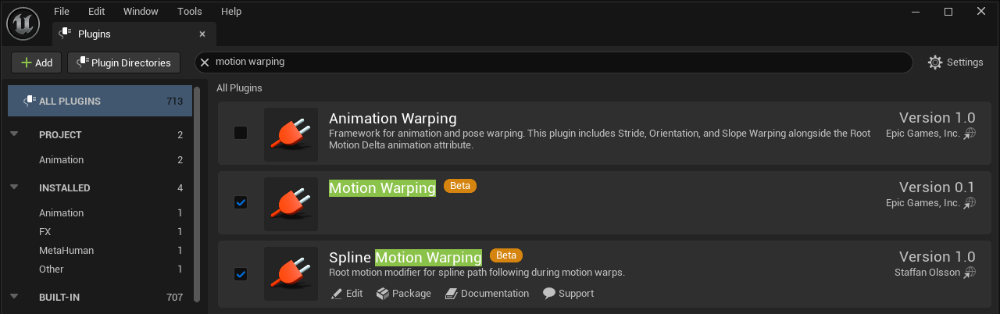
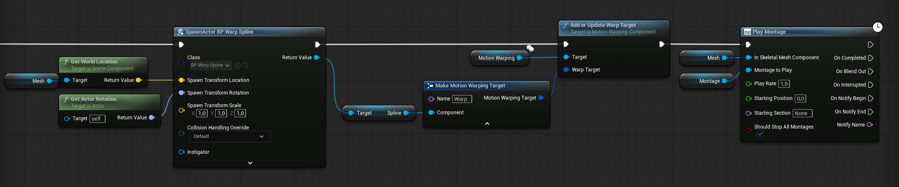

# Spline Motion Warping

**Spline Motion Warping** extends Unreal Engine's built-in [Motion Warping](https://dev.epicgames.com/documentation/en-us/unreal-engine/motion-warping-in-unreal-engine) system with a new root motion modifier: **Spline Warp**. Instead of warping in a straight line to a target, the character smoothly follows any curve you draw with a Spline Component.

Use it for traversal abilities (rolls along curved paths, dashes around corners), cinematic movement (characters following scripted paths), or any gameplay where linear warping is too rigid.

🛒 [Get it on Fab](https://www.fab.com/portal/listings/13abea64-26ff-4e61-b731-0b389d2e5738) | 🎬 [Tutorial](https://youtu.be/5JiHij93gV4) | 📦 [Demo Project](https://github.com/StaffanJOlsson/SplineMWDemo)

---

## Table of Contents

- [Requirements](#requirements)
- [Installation](#installation)
- [Setup Guide](#setup-guide)
  - [Step 1 -- Motion Warping Basics](#step-1----motion-warping-basics)
  - [Step 2 -- Create a Spline Actor](#step-2----create-a-spline-actor)
  - [Step 3 -- Select Spline Warp in the Montage](#step-3----select-spline-warp-in-the-montage)
  - [Step 4 -- Spawn, Register, and Play](#step-4----spawn-register-and-play)
- [Spline Warp Properties](#spline-warp-properties)
- [Rotation Modes](#rotation-modes)
- [Blend In](#blend-in)
- [Debug Visualization](#debug-visualization)
- [Blueprint Factory Function](#blueprint-factory-function)
- [Example Project](#example-project)
- [Video](#video)
- [Troubleshooting](#troubleshooting)
- [Support](#support)

---

## Requirements

| Requirement | Details |
|---|---|
| **Engine Version** | Unreal Engine 5.6 or higher |
| **Engine Plugin** | **MotionWarping** must be enabled (ships with UE) |
| **Root Motion** | Your animation must have **Enable Root Motion** enabled |
| **Platforms** | Win64, Mac, Linux |

---

## Installation

1. Download the plugin zip for your engine version.
2. Extract the `SplineMotionWarping` folder into your project's `Plugins/` directory, so the path is: `YourProject/Plugins/SplineMotionWarping/SplineMotionWarping.uplugin`
3. Build the project from source (right-click the `.uproject` → Generate Visual Studio project files, then Build in VS or use UnrealBuildTool).
4. Under **Edit > Plugins**, search for "Motion Warping" and verify both **Motion Warping** and **Spline Motion Warping** are enabled.

---

## Setup Guide

### Step 1 -- Motion Warping Basics

Spline Motion Warping builds on top of Epic's Motion Warping system. If you are new to Motion Warping, start with Epic's official documentation:

> **[Motion Warping in Unreal Engine -- Epic Documentation](https://dev.epicgames.com/documentation/en-us/unreal-engine/motion-warping-in-unreal-engine)**

That guide covers:
- Enabling the Motion Warping plugin
- Adding the **Motion Warping Component** to your character
- Creating an **Animation Montage** with a **Motion Warping notify state**
- Using **Add or Update Warp Target** in Blueprints

Once you have a working Motion Warping setup (even a simple Skew Warp to a target point), you are ready to swap in a spline path. The following steps show what is **different** for Spline Warp.

### Step 2 -- Create a Spline Actor

The spline defines the curved path the character will follow during the warp. The recommended approach is to create a **Blueprint Actor** with a pre-designed Spline Component, then **spawn it at runtime** with the desired transform.

1. Create a new **Actor Blueprint** (e.g., `BP_WarpSpline`).
2. Add a **Spline Component** as the root or a child component.
3. Shape the spline's control points in the Blueprint editor to define the path (e.g., a curve, an arc, an S-bend).
4. At runtime, **Spawn Actor from Class** using your spline actor Blueprint. Set the spawn transform relative to the character or world position so the path starts and ends where you need it.

> **Important:** The spline must **not** be a child of the character performing the warp. If the spline moves with the character, the path shifts during traversal and produces erratic results. Always spawn it as a standalone actor in the world.

### Step 3 -- Select Spline Warp in the Montage

1. Open your **Animation Montage**.
2. If you don't already have one, add a **Motion Warping** notify state on the Notifies track (right-click > Add Notify State > Motion Warping).
3. Position the notify window to cover the section of the animation where the character should follow the spline.
4. Select the notify state and look at the **Details** panel.
5. Set **Root Motion Modifier** to **Spline Warp** (instead of Skew Warp or Scale).
6. Set **Warp Target Name** to a unique identifier (e.g., `SplinePath`). This must match the name used in Step 4.

You will also see the Spline Warp-specific properties described in the next section.

### Step 4 -- Spawn, Register, and Play

At runtime, the full flow is: **Spawn** the spline actor → **Make** a warp target from its Spline Component → **Register** it on the Motion Warping Component → **Play** the montage. This is the key difference from standard Motion Warping — instead of passing a target transform, you pass the **Spline Component** itself.

1. **Spawn Actor from Class** — Spawn your spline actor Blueprint (from Step 2). Set the spawn transform relative to the character so the path starts and ends where you need it.
2. **Make Motion Warp Target from Component** — Get the spawned actor's **Spline Component** and create a warp target. Set the **Name** to match the notify from Step 3 (e.g., `SplinePath`).
3. **Add or Update Warp Target** — Pass the warp target to the character's **Motion Warping Component**.
4. **Play Montage** — Trigger the montage. When playback reaches the warp window, the character follows the spline path instead of warping in a straight line.

---

## Spline Warp Properties

When you select Spline Warp as the Root Motion Modifier, the following properties appear in the notify state's Details panel:

| Property | Type | Default | Description |
|---|---|---|---|
| **Spline Rotation Mode** | Enum | `FaceSplineTangent` | How the character's rotation is driven during the warp. See [Rotation Modes](#rotation-modes). |
| **Z Axis Only** | Bool | `true` | Constrain rotation to yaw only. Prevents pitch and roll changes from spline curvature. |
| **Blend In Ratio** | Float (0--1) | `0.0` | Fraction of the warp window spent easing from raw root motion onto the spline. See [Blend In](#blend-in). |
| **Draw Debug** | Bool | `false` | Enable runtime debug visualization. See [Debug Visualization](#debug-visualization). |
| **Debug Draw Duration** | Float | `0.0` | How long debug lines persist (seconds). 0 = single frame. |

The standard Motion Warping properties are also available:

| Property | Type | Default | Description |
|---|---|---|---|
| **Warp Translation** | Bool | `true` | Warp the character's position along the spline. |
| **Warp Rotation** | Bool | `true` | Warp the character's facing direction. |
| **Ignore Z Axis** | Bool | `false` | Ignore the spline's vertical position; use the raw root motion height instead. |

---

## Rotation Modes

The **Spline Rotation Mode** controls how the character faces during the warp:

### FaceSplineTangent *(Default)*
The character rotates to face the direction of travel along the spline. As the spline curves, the character turns to follow.

**Best for:** Traversal abilities -- rolls, dashes, vaults -- where the character should look where they are going.

### FaceTarget
The character rotates to face the **end point** of the spline throughout the entire warp.

**Best for:** Strafing movements where the character keeps facing a fixed point while moving along a curved path.

### Locked
The character's rotation is frozen to whatever it was when the warp began.

**Best for:** Backward movements, side-steps, or any action where the initial facing must be preserved.

### UseWarpRotation
Falls back to the standard Motion Warping rotation logic. The rotation is computed from the animation's root motion delta toward the warp target.

**Best for:** When you want standard rotation behavior but with spline-based translation.

---

## Blend In

The **Blend In Ratio** controls how the character transitions from raw root motion onto the spline at the start of the warp window:

| Value | Behavior |
|---|---|
| `0.0` | No blend. Character snaps to the spline position immediately. |
| `0.1` | First 10% of the warp duration eases from raw root motion onto the spline. |
| `0.5` | Half the warp duration is spent easing in. |

Uses smooth-step interpolation for a natural transition. A value between `0.05` and `0.15` is recommended for most use cases.

**Example:** If the warp window is 1.0 second and Blend In Ratio is `0.1`, the character spends the first 0.1s easing onto the spline, then follows it for the remaining 0.9s.

---

## Debug Visualization

Enable **Draw Debug** on the notify state to see what the spline warp is doing at runtime:

| Visual | Color | Meaning |
|---|---|---|
| Spline path (behind character) | Green | Portion of the spline already traversed |
| Spline path (ahead of character) | Cyan | Remaining spline path |
| Start marker | Green sphere | Spline start point |
| End marker | Red sphere | Spline end point |
| Desired position | Yellow sphere | Where the character is being pulled toward |
| Character-to-desired line | Orange | Gap between actual and desired position |
| Progress text | White | Current warp completion percentage |

> Debug visuals are available in Development and Debug builds only (stripped from Shipping).

---

## Blueprint Factory Function

For advanced or procedural setups, you can add a Spline Warp modifier directly from Blueprints without a notify state:

**Node:** `Add Root Motion Modifier Spline Warp`

| Pin | Type | Description |
|---|---|---|
| Motion Warping Comp | `MotionWarpingComponent` | The character's Motion Warping Component |
| Animation | `AnimSequenceBase` | The animation being played |
| Start Time | Float | Warp window start (seconds into the animation) |
| End Time | Float | Warp window end (seconds into the animation) |
| Warp Target Name | Name | Must match the registered warp target name |
| Rotation Mode | Enum | One of the four rotation modes |
| Blend In Ratio | Float | 0.0 to 1.0 |

---

## Example Project

A standalone example project is available that demonstrates a complete working setup using the Third Person template:

> **[Download Example Project](https://github.com/StaffanJOlsson/SplineMWDemo)**

The example includes:
- A character with a Motion Warping Component
- A spline path placed in the level
- An animation montage configured with a Spline Warp notify
- Input binding to trigger the warp on key press
- Debug visualization enabled

---

## Video

See the plugin in action:

> **[Spline Motion Warping Tutorial](https://youtu.be/5JiHij93gV4)**

The video covers setup, different rotation modes, blend-in behavior, and debug visualization.

---

## Troubleshooting

| Problem | Solution |
|---|---|
| **Character teleports to spline start** | Set Blend In Ratio to a small value (e.g., `0.1`) to ease onto the spline. |
| **Character follows the spline erratically** | Make sure the spline is **not** a child of the character. Use a standalone spline actor. |
| **Warp doesn't activate** | Verify the Warp Target Name in the montage matches the name in Add or Update Warp Target. Ensure the target is registered before the notify window starts. Confirm the animation has root motion enabled. |
| **Character warps in a straight line** | The Warp Target's Component pin must be connected to the Spline Component. If you pass only a transform, standard linear warping is used. |
| **Character floats or clips through ground** | Enable Ignore Z Axis on the notify state to preserve raw root motion height. |
| **Rotation looks jittery** | Enable Z Axis Only to constrain rotation to the horizontal plane. |
| **Debug lines don't appear** | Draw Debug only works in Development/Debug builds. Also check the console variable `MotionWarping.Debug`. |

---

## Support

- [Fab Store Page](https://www.fab.com/portal/listings/13abea64-26ff-4e61-b731-0b389d2e5738)
